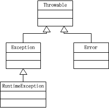

###本章主题

以前在项目的开发中，异常都是 Eclipse 自动添加的，而我却没有问过自己why。所以导致对异常的理解很浅。在我眼里，异常提供2个功能：

* 程序为什么崩溃（异常类型）？
* 在哪里崩溃的（打印的堆栈信息）？

在看完本章后，就要弄清楚异常的工作原理。只有这样，才能在以后自定义异常时更加规范。那么异常是在什么背景下被提出来的呢？

> 在C语言以及其他早期语言中，错误处理模式是通过返回一个特殊值或者标志某个flag来告诉使用者程序的运行状况。**这些返回值不属于语言本身，而是一种约定俗成的习惯。**所以，随着程序语言的发展，逐渐将错误机制给抽象出来，形成了一套完整的理论。从最早的Basic的`on error goto`，到Ada语言，然后C++借鉴了Ada语言的异常处理机制。再往后，Java中的异常处理是建立在C++的异常处理机制之上。

看完本章，我感觉异常有以下优点：

1. 解耦业务和实现细节：程序员可以专注于业务逻辑，而不必纠缠于业务逻辑和错误处理逻辑交织造成的困扰
2. 代码清晰：业务逻辑和错误处理被分到两个“模块”中，可以清晰的看出业务功能和出错后的补救策略
3. 迅速定位错误位置：当正确使用异常，可以最快锁定异常出现的位置并进行修改（如何正确使用下面会讲到）


###一、Java 异常框架

首先我们看一下异常处理的过程：


* 从上图可以看出，必定在运行的 Java 应用程序的一些类或对象中产生异常。出现故障时，“发送者”将产生异常对象。异常可能代表 Java 代码出现的问题，也可能是 JVM 的相应错误，或基础硬件或操作系统的错误。
* 异常本身表示消息，指发送者传给接收者的数据“负荷”。首先，异常基于类的类型来传输有用信息。很多情况下，基于异常的类既能识别故障本因并能更正问题。其次，异常还带有可能有用的数据（如属性）。
* 在处理异常时，消息必须有接收者；否则将无法处理产生异常的底层问题。

因为 Java 中一切都是对象，所以异常也是通过对象实现的。我们先从整体上了解一下 Java 的异常框架，它非常简单，但是却发挥了很大的作用。不禁让我想起了 Apple 的一句广告词：简约而不简单：）



从上图，我们可以将 Java 异常框架分为3个关键点：

1. Throwable：所有异常的根，定义异常的规范
1. Error：系统级严重错误，近似认为用户不会碰到
2. Exception：用户级中低等错误
	1. RuntimeException：运行时异常（unchecked）
	2. OtherException：其他异常（checked）

在Exception的子类中，有一个非常值得关注的异常类型：**RuntimeException（及其子类）**。它们会自动被 JVM 抛出，所以不必在方法声明中指出该函数可能抛出。根据这点，我们可以将Exception再分为两类：

* unchecked Exception：RuntimeException及其子类，不需要在函数中显式声明抛出该异常， JVM 会在运行期间自动抛出
* checked Exception：其他Exception的子类，编译器会强制要求在函数中显式声明函数可能抛出的异常

Tips:

> 如果RuntimeException没有被捕获而直达`main()`，那么在程序退出前将调用异常的`printStackTrace()`方法。所以，只能忽略RuntimeException（及其子类）类型的异常，其他类型异常都必须在函数声明中显式说明。究其原因是因为RuntimeException代表的是**编程错误**：

1. 无法预料的错误：比如在函数外部传进来一个null引用
2. 作为程序员应该在代码中检查的错误（比如ArrayIndexOutOfBoundsException作为一个RuntimeException，代表使用数组时候越界访问了）

###二、Exception的正确用法

在Java中，使用Exception的方法很简单：

```
try {
	//业务逻辑
} catch(SmallException e) {
	//异常处理1
} catch(MiddleException e) {
	//异常处理2
} catch(Exception e) {
	//异常处理3
} finally {
	//扫尾工作
}
```

上面就是平常使用的`try{...}catch{...}finally{...}`模型。看起来没什么大不了的呀，因为我在看《TIJ》之前就是这么用的。但是看完之后发现：

* 原来我根本就没碰异常，我只是调用`e.printStackTrace()`打印了一下堆栈。而且不知道这个版本是讲堆栈重定向到标准错误流。而其他重载版本可以重定向到其他流中
* 没碰异常肯定不会做一些补救措施。比如我的函数不能处理但上层能处理，我catch之后没有抛出给上层。到我这里，异常沉没了
* 压根没思考过如何正确的使用异常。比如用 NIO 打开文件，就可能涉及到很多情况。在文章的最后一部分我们会举例子

那么，既然看完了这一章。就要能说清楚怎样正确使用异常：

1. 抽象问题，定接口。这时候就要思考程序可能抛出哪些异常
2. 思考内部能处理哪些异常，不能处理哪些。对不能处理的异常，捕获后要抛给上层，不然就会沉没
3. 对于不能处理的异常，是抛出原异常，还是其他异常？抛出时的起点在哪里（是我的函数，还是底层实现的那个地方。这与`fillInStackTrace()`有关）？
4. 

我们平常在程序中可能只会用到```e.printStackTrace();```，意思是打印异常的堆栈到标准错误流。这个函数有其他的重载版本，如果参数为空，就默认**将打印的错误堆栈信息发送给标准错误流(System.err)而不是标准输出流(System.out)中。**这样定义，可以将正常输出和错误分开处理。比如你想将异常信息输出到标准输出流，就可以使用```e.printStackTrace(System.out);```，还有一种是打印到web应用中```e.printStackTrace(PrintWriter);```。但这是**错误的用法**，因为你catch了异常却什么都没有做。

###2. 异常初始化

有两种，可以带上参数。在打印堆栈信息时，在抛出的异常后面添加一些说明。比如```throw new XXException("The parameter must be a int");```。这样，我通过异常的堆栈，马上就知道是参数传递的类型出现了错误。其实我理解这个参数就相当于注释了吧。

###3. RuntimeException及其子类自动抛出

有个细节以前没注意。在写代码时，一些会抛出异常的方法你必须显式的放在try...catch...中，但是对于空指针或者数组越界，你不用放在try...catch...中，一样会抛出异常。这是为什么呢？
> 原来它们属于**运行时异常**，会自动被Java虚拟机抛出，所以不必在异常说明中把它们列出来。这些异常都是从**RuntimeException类**继承而来的，所以既体现了继承的有点，使用起来也很方便。

下面我们可以写个小程序玩一下：

```
package Chapter12;

public class NeverCaught {
	static void f() {
		throw new RuntimeException("from f()");
	}
	static void g() {
		f();
	}
	public static void main(String[] args) {
		g();
	}
}
/** output
Exception in thread "main" java.lang.RuntimeException: from f()
	at Chapter12.NeverCaught.f(NeverCaught.java:5)
	at Chapter12.NeverCaught.g(NeverCaught.java:8)
	at Chapter12.NeverCaught.main(NeverCaught.java:11)

*/
```

我们发现，它是在**main函数中被捕获的（in thread main）**，说明f()扔了没人管，于是到达g()，g()也不管，于是到达main()，main一看，我去，我也不会处理这玩意啊。于是到达Java虚拟机，Java虚拟机一看是RuntimeException或者是它的子类，就会果断处理。

再看这个例子：

```
package Chapter12;

import java.io.IOException;

public class NeverCaught {
	static void f() {
		try {
			throw new IOException("from f()");
		} catch (IOException e) {
			e.printStackTrace();
		}
	}
	static void g() {
		f();
	}
	public static void main(String[] args) {
		g();
	}
}
/** output:
java.io.IOException: from f()
	at Chapter12.NeverCaught.f(NeverCaught.java:8)
	at Chapter12.NeverCaught.g(NeverCaught.java:14)
	at Chapter12.NeverCaught.main(NeverCaught.java:17)

*/
```

而这里的异常是**从f()函数抛出**的。而且在f()中，必须显式的将抛出声明语句放在try...catch...中或者是显式声明抛出异常。


###4. finally的使用

try...catch...机制已经算是比较完整了，但是有时候也会有点麻烦。因为Java没有析构函数，而有的资源必须回收/释放，我们知道Java有GC机制，但是前面也说到，GC机制只作用于**内存**，对于内存以外的资源不会管，比如文件操作、网络IO资源等。在没有finally的情况下也可以解决，就是在try中和catch中实现相同的关闭方法，这样无论是抛出/不抛出异常，都能保证资源的正确释放。但是，另外还有一种情况就步行了，如果有return语句在清理工作的代码前面，try和catch都是无力回天。

总结一下finally的用法：

1. 对于无论抛出/不抛出异常都要执行的语句，放在finally中
2. 对于try中return后还需要做其它工作的，放在finally中

看下面的例子：

```
package Chapter12;

class NSException extends Exception {

}

public class CatchWithoutFinally {

	public static boolean open(String name) throws NSException {
		if (name.equals("C++")) {
			throw new NSException();
		}
		return true;
	}

	public static void gun() {
		String[] strings = { "Java", "C++", "C", "C#" };
		for (int i = 0; i <= 3; ++i) {
			try {
				boolean flag = open(strings[i]);
				if (flag == false) {
					return;
				}
				System.out.println("file :" + strings[i] + " close");
			} catch (NSException e) {
				e.printStackTrace();
			}
		}
	}

	public static void main(String[] args) {
		gun();
	}
}
/** output:
file :Java close
Chapter12.NSException
        at Chapter12.CatchWithoutFinally.open(CatchWithoutFinally.java:11)
	at Chapter12.CatchWithoutFinally.gun(CatchWithoutFinally.java:20)
	at Chapter12.CatchWithoutFinally.main(CatchWithoutFinally.java:32)
file :C close
file :C# close
*/
```

然后再看下用了finally之后的情况：

```
package Chapter12;

class NSException extends Exception {

}

public class CatchWithoutFinally {

	public static boolean open(String name) throws NSException {
		if (name.equals("C++")) {
			throw new NSException();
		}
		return true;
	}

	public static void gun() {
		String[] strings = { "Java", "C++", "C", "C#" };
		for (int i = 0; i <= 3; ++i) {
			try {
				boolean flag = open(strings[i]);
				if (flag == false) {
					return;
				}
			} catch (NSException e) {
				e.printStackTrace();
			} finally {
				System.out.println("file :" + strings[i] + " close");
			}
		}
	}

	public static void main(String[] args) {
		gun();
	}
}
/** output:
file :Java close
Chapter12.NSException
	at Chapter12.CatchWithoutFinally.open(CatchWithoutFinally.java:11)
	at Chapter12.CatchWithoutFinally.gun(CatchWithoutFinally.java:20)
	at Chapter12.CatchWithoutFinally.main(CatchWithoutFinally.java:33)
file :C++ close
file :C close
file :C# close
*/
```

从上面2个例子可以清晰的看到，第一种情况下C++没有被关闭，而第二种情况，无论你在try...catch...中干了什么，我finally都能完成最后的清理工作。

###5. 异常的缺憾：异常丢失

这个缺憾我感觉咋可以避免呢，因为这里所说的缺憾是指把finally放在catch的前面，这样，当抛出异常之后，我直接执行finally了，而finally是默认作为最后步骤执行的，所以执行完finally之后就不会继续执行下面的东西了。下面是个例子：

```
package Chapter12;

class VeryImportantException extends Exception {
	public String toString() {
		return "A very import Exception";
	}
}

class HoHumException extends Exception {
	public String toString() {
		return "A trivial exception";
	}
}

public class LostMessage {
	void f() throws VeryImportantException {
		throw new VeryImportantException();
	}

	void dispose() throws HoHumException {
		throw new HoHumException();
	}

	public static void main(String[] args) {
		try {
			LostMessage lostMessage = new LostMessage();
			try {
				lostMessage.f();
			} finally {
				lostMessage.dispose();
			}
		} catch (Exception e) {
			System.out.println(e);
		}
	}
}
/** output:
A trivial exception
*/
```

这个例子中，我们会发现先抛出了VeryImportantException，然后dispose()又抛出了HoHumException，结果catch的时候只能catch最后那个，原来的给弄丢了。当然，解决方法就是catch的异常一定要从小到大。**从根本来说，finally尽量放在异常的最后。**

另外一种是在finally中使用return语句，这样就会进入所谓的silence模式，运行程序的时候，即使抛出了异常，也不会产生任何输出。下面是个例子：

```
package Chapter12;

public class ExceptionSilencer {
	public static void main(String[] args) {
		try {
			System.out.println("hello");
			throw new RuntimeException();
		} finally {
			return ;
		}
	}
}
/** output: 
hello
*/
```

我们会发现异常没有输出。。。。

###6. 异常说明

C++从CLU哪里带来了一种思想：异常说明。这样，就可以用编程的方式在方法的特征签名中，声明这个方法将会抛出异常。异常说明可能有两种意思：

1. 我的代码会产生这种异常，这由你来处理
2. 我的代码忽略了这些异常，这由你来处理
