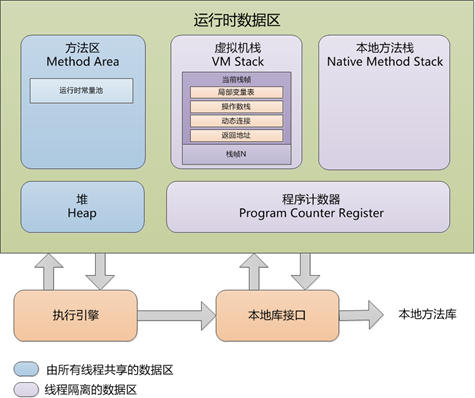

##前言

本章主要讲述Java内存相关的知识，因为Java与C++之间有一堵由内存动态分配和垃圾收集技术所围成的高墙，墙外面的人想进去，墙里面的人想出来。

* C++的内存管理完全由程序员管理，所以效率比较高，但同时牺牲了安全性（如果程序员稍微不注意，就可能造成内存溢出等问题）
* Java实现了对内存管理的透明，程序员只需要关注业务逻辑，这就保证了开发效率会很高，安全性也有保证。但是很多情况下，程序的性能并没有发挥到极致

这样看来，两者都各有千秋。但是在目前大部分应用中，java的性能已经被优化的很强了。一个问题就是：

> Java到底是通过什么完成这些功能呢？要知其然知其所以然。下面我们就来学习一下Java是如何管理内存的

##一、运行时数据区域

Java虚拟机在执行Java程序的过程中，会把内存分为不同的数据区域。如下图所示：

###1. 程序计数器

它是一块较小的内存空间，作用可以当做是**当前线程所执行的字节码的行号指示器。**在虚拟机的概念模型里，字节码解释器工作时就是通过改变这个计数器的值来选取下一跳需要执行的字节码指令，分支、循环、跳转、异常处理、线程恢复等基础功能都需要依赖这个计数器。

因为java虚拟机的多线程是通过时间片轮转占用cpu，所以一个处理器只会执行一条线程的指令。所以，为了线程切换后能恢复到正确的位置，每条线程都需要一个独立的程序计数器，所以，这类区域是“线程独有”内存。

###2. Java虚拟机栈

Java虚拟机栈也是**线程私有**的，它的生命周期和线程相同（废话...)。虚拟机栈会在每个方法被性质的时候创建一个栈帧用于存储局部变量表、操作栈、动态链接、方法出口等信息。每一个方法被调用直至执行完成的过程就对应着一个栈帧在虚拟机中从入栈到出栈的过程。

###3. 本地方法栈

本地方法栈与虚拟机栈的作用类似，区别是**虚拟机栈为虚拟机执行Java方法（也就是字节码）服务，而本地方法栈则是为虚拟机使用到的Native方法服务。因为虚拟机规范没有对这块有太多规定，所以不同的虚拟机可以自由实现它。而由的虚拟机（对，Sun的HotSpot虚拟机）直接就把本地方法栈和虚拟机栈合二为一了。。。

###4. Java堆

对于大多数应用来说，Java堆是Java虚拟机所管理的内存中最大的一块。Java堆是所有线程共享的一块内存区域，在虚拟机启动的时候创建（参数为Xmx、Xms）。就是放对象实例的。

###5. 方法区

方法区与Java堆一样，是各个线程共享的内存区域，它用于存储**已被虚拟机加载的类信息、常量、静态变量、即时编译器编译后的代码等数据。

###6. 运行时常量池

是方法区的一部分。**class文件中除了有类的版本、字段、方法、接口等描述信息外，还有一项信息是常量池，用于存放编译期生成的各种字面值和符号引用，这部分内容将在类加载后存放到方法区的运行时常量池中**。

###7. 直接内存

直接内存并不是虚拟机运行时数据区的一部分，也不是Java虚拟机规范中定义的内存区域，但是这部分内存也被频繁地使用，而且也可能导致OutOfMemoryError异常出现，这里大概谈谈。

JDK 1.4中新加入了NIO(NEW Input/Output)类，引入了一种基于通道与缓冲区的I/O方式，可以使用Native函数库直接分配堆外内存，然后通过一个存储在Java堆里面的DirectByteBuffer对象作为这块内存的引用进行操作。这样能在一些场景中显著提高性能，因为避免了在Java堆和Native堆中来回复制数据。

##二、对象访问

我们来思考一个问题吧：在Java语言中，对象访问是如何进行的？比如`Object obj = new Object();`？

> 假如代码出现在方法体中，那么Object obj就会存在在Java栈的本地变量表中，作为一个引用类型数据。而new Object()则存在在Java堆上。由于引用类型在Java虚拟机规范里面只规定了一个指向对象的引用，并没有定义这个引用应该通过哪种方式去定位，以及访问到Java堆中的对象的具体位置，因此不同虚拟机实现的对象访问方式可能不同，主流的有：

1. 使用句柄：Java堆中划分一块区域作为句柄池，引用存储的是对象的句柄地址，而句柄中含有对象实例数据和类型数据各自的数据信息
2. 直接指针：引用中直接存储的就是对象的地址

不同的实现有不同的优缺点：

1. 使用句柄：引用中存储的是稳定的句柄地址，在对象被移动（垃圾回收时移动对象是非常普遍的行为）时只需要改变句柄中的实例数据指针，而引用本身不需要修改
2. 直接指针：速度快，因为不需要间接寻址。对于效率而言是更好的。Sun HotSpot就是使用这种方式实现对象访问的。

##三、实战演练

下面我们会演示几个小程序，目的有两个：

1. 通过代码验证Java虚拟机规范中描述的各个运行时区域存储的内容
2. 希望以后遇到类似问题时，能根据异常的信息快速判断是哪个区域的内存溢出，知道怎样的代码可能会导致这些区域的内存溢出，以及出现这些异常后改如何处理

###1. Java堆溢出

这个顾名思义，是最常见的。因为Java堆上存储的是对象实例，所以只要保证GC roots到该对象有路径可达，就会在不断创建对象的过程中达到Java堆的最大容量而导致溢出。下面是实例代码：


package Chapter_02;

import java.util.ArrayList;
import java.util.List;

/**
 * 
 * @author niushuai
 * 
 * 虚拟机参数：
 * -verbose:gc -Xmx20M -Xms20M -Xmn10M -XX:+PrintGCDetails -XX:SurvivorRatio=8
 * 
 */
public class HeapOOM {
	static class OOMObject {
		
	}
	
	public static void main(String[] args) {
		List<OOMObject> list = new ArrayList<OOMObject>();
		while(true) {
			list.add(new OOMObject());
		}
	}
}/*output:
[GC [PSYoungGen: 7363K->1001K(9216K)] 7363K->5017K(19456K), 0.0097670 secs] [Times: user=0.03 sys=0.01, real=0.01 secs] 
[GC [PSYoungGen: 9193K->1024K(9216K)] 13209K->10550K(19456K), 0.0113040 secs] [Times: user=0.04 sys=0.00, real=0.02 secs] 
[Full GC [PSYoungGen: 1024K->511K(9216K)] [ParOldGen: 9526K->9982K(10240K)] 10550K->10494K(19456K) [PSPermGen: 2564K->2563K(21504K)], 0.3076080 secs] [Times: user=0.65 sys=0.01, real=0.30 secs] 
[Full GC [PSYoungGen: 8335K->8240K(9216K)] [ParOldGen: 9982K->7866K(10240K)] 18317K->16106K(19456K) [PSPermGen: 2563K->2563K(21504K)], 0.1443110 secs] [Times: user=0.32 sys=0.00, real=0.14 secs] 
[Full GC [PSYoungGen: 8240K->8240K(9216K)] [ParOldGen: 7866K->7855K(10240K)] 16106K->16095K(19456K) [PSPermGen: 2563K->2563K(21504K)], 0.0994290 secs] [Times: user=0.31 sys=0.01, real=0.10 secs] 
Exception in thread "main" java.lang.OutOfMemoryError: Java heap space
	at java.util.Arrays.copyOf(Arrays.java:2245)
	at java.util.Arrays.copyOf(Arrays.java:2219)
	at java.util.ArrayList.grow(ArrayList.java:242)
	at java.util.ArrayList.ensureExplicitCapacity(ArrayList.java:216)
	at java.util.ArrayList.ensureCapacityInternal(ArrayList.java:208)
	at java.util.ArrayList.add(ArrayList.java:440)
	at Chapter_02.HeapOOM.main(HeapOOM.java:20)
Heap
 PSYoungGen      total 9216K, used 8597K [0x00000007ff600000, 0x0000000800000000, 0x0000000800000000)
  eden space 8192K, 98% used [0x00000007ff600000,0x00000007ffde5818,0x00000007ffe00000)
  from space 1024K, 49% used [0x00000007fff00000,0x00000007fff7ff00,0x0000000800000000)
  to   space 1024K, 0% used [0x00000007ffe00000,0x00000007ffe00000,0x00000007fff00000)
 ParOldGen       total 10240K, used 7855K [0x00000007fec00000, 0x00000007ff600000, 0x00000007ff600000)
  object space 10240K, 76% used [0x00000007fec00000,0x00000007ff3abe10,0x00000007ff600000)
 PSPermGen       total 21504K, used 2595K [0x00000007f9a00000, 0x00000007faf00000, 0x00000007fec00000)
  object space 21504K, 12% used [0x00000007f9a00000,0x00000007f9c88cd8,0x00000007faf00000)

*/


从上面的结果可以看到，发生了OOM异常。要解决这个异常，一般是把内存快照dump下来用工具分析，确认**内存中的对象是否是必要的**，也就是要先分清到底是出现了内存泄露还是内存溢出。

* 如果是内存泄露：使用工具查看泄露对象到GC Roots的引用链。于是就可以顺藤摸瓜找到泄漏对象是通过怎样的路径关联GC Roots的，从而准确定位泄露代码的位置
* 如果是内存溢出：就应当检查虚拟机的堆参数（-Xmx和-Xms），与机器物理内存对比看是否可以调大，从代码上检查是否存在某些对象生命周期过长、持有状态时间过长等情况，尝试减少程序运行期间的内存消耗
