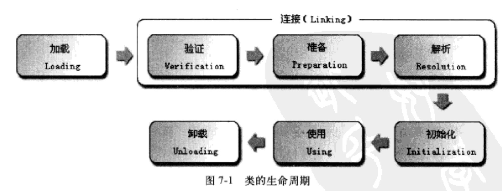

###前言

这一章是讲类加载的，前阵子刚刚研究了类加载机制的实现。不过那时候是以代码为主，对JVM内部如何工作的不太清楚。正好趁这个机会巩固一下。

类从加载到虚拟机内存开始，到卸载出内存，一共经历了7个步骤：

1. 加载
2. 验证
3. 准备
4. 解析
5. 初始化
6. 使用
7. 卸载

下图是类的生命周期：

其中，对于如何加载，Java虚拟机规范并没有说明。但是对于初始化，Java虚拟机规范做了严格的限制，**有且只有**这四种情况必须立即对类进行"初始化"（而加载、验证、准备必须在初始化的前面了）：

1. 遇到new、getstatic、putstatic、invokestatic这四条指令码时，如果类没有进行初始化。必须触发初始化
2. 使用java.lang.reflect包的方法对类进行反射调用的时候，如果类没有进行初始化，必须触发初始化
3. 当初始化一个类时，如果其父类还没有初始化，则触发初始化
4. 当虚拟机启动时，用户需要指定一个要执行的主类，虚拟机会先初始化这个主类

这四种场景中的行为被称为主动引用，除此之外所有引用类的方式都不会触发初始化，称为被动引用。下面有3个例子供大家欣赏= =


class A {
	
	public static int count = 10;
	
	static {
		System.out.println("super class");
	}
}

class B extends A {
	static {
		System.out.println("sub class");
	}
}

public class Example_One {
	public static void main(String[] args) {
		System.out.println(B.count);
	}
}/*output:
super class
10
*/


我们会发现，纳尼！！竟然没有输出`sub class`，很奇怪是吧。原因如下：

> 对于静态字段，只有直接定义这个字段的类才会初始化，因此通过子类来调用父类的静态字段，只会触发父类的初始化而不会触发子类的初始化。


class A {
	
	public static int count = 10;
	
	static {
		System.out.println("super class");
	}
}

class B extends A {
	static {
		System.out.println("sub class");
	}
}

public class Example_One {
	public static void main(String[] args) {
		B[] bs = new B[10];
	}
}


这段代码执行的时候，没有任何输出。也就是说没有触发初始化。





