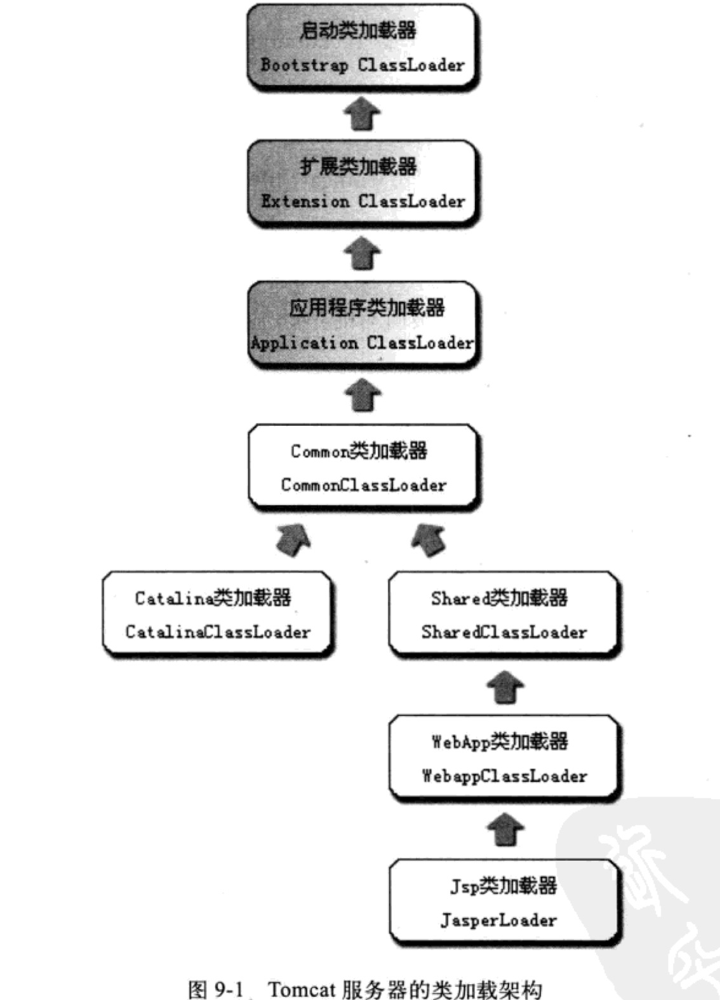

###前言

这一章是给出了几个例子说明前面几章讲过的内容。我觉得关于tomcat那个例子对我来说太有用了。正好被这个问题困扰，然后今天看完瞬间感觉豁然开朗。而这一章关注点有：

* 类加载器
* 字节码生成

因为平时跟字节码打交道的场景不多，而最近研究类加载器算是比较多。所以，这章我主要关注的就是类加载器相关的东西。

###类加载器实例之——Tomcat

主流的Java Web服务器，如Tomcat、Jetty、WebLogic、WebSphere，都实现了自己定义的类加载器（一般都不止一个）。因为一个功能健全的Web服务器，要解决如下问题：

* **部署在同一个服务器上的两个Web应用程序所使用的Java类库可以使用相互隔离。**这是最基本的要求，因为不同应用可能依赖同一个类库的不同版本，不能要求每个类库在一个服务器只有一个版本，应当保证两个应用程序的类库可以互相独立使用
* **部署在同一个服务器上的两个Web应用程序所使用的Java类库可以互相共享。**这个也很正常，比如我有10个应用程序，都用到Spring，那么我不可能放10份Spring相关的类库吧。
* 服务器需要尽可能地保证自身的安全不受部署的Web应用程序影响。目前很多Java Web服务器也是Java实现的，因此肯定有库依赖问题。一般来说，基于安全考虑，服务器所使用的类库应该和应用程序的类库相互独立
* 支持Jsp应用的Web服务器，十有八九都需要支持HotSwap功能。因为Jsp本质上还是需要被编译成.class文件才能被JVM执行，但Jsp在运行时被修改的概率比较大。因此主流Web服务器都会支持Jsp生成类的热替换

由于以上几个要求，如果只有一个CLASSPATH就很难实现了。**所以各种Web服务器都会提供好几个CLASSPATH路径供用户存放第三方类库，这些路径一般都以lib或者classes命名。被放置在不同目录的类库，具备不同的访问范围和服务对象。通常而言，每一个目录都会有一个对应的自定义类加载器去加载设置在里面的Java类库。**那么我们就以Tomcat为例来看一下。

在Tomcat目录结构中，有三组目录可以存放Java类库，另外加上应用程序自身的目录，一共四组：

1. 放置在/common目录中：类库可被Tomcat和所有Web应用程序共同使用
2. 放置在/server目录中：类库只能被Tomcat使用
3. 放置在/shared目录中：类库可以Web应用程序共同使用，但是Tomcat不能使用
4. 放置在/webapp/WEB-INF目录中：仅仅可以被这个Web应用程序使用，Tomcat和其它Web应用程序不能使用

为了支持这套目录，并对目录内的类库进行加载和隔离，Tomcat自定义了几个类加载器，这些类加载器按照经典的双亲委派模型来实现，如下图所示：

