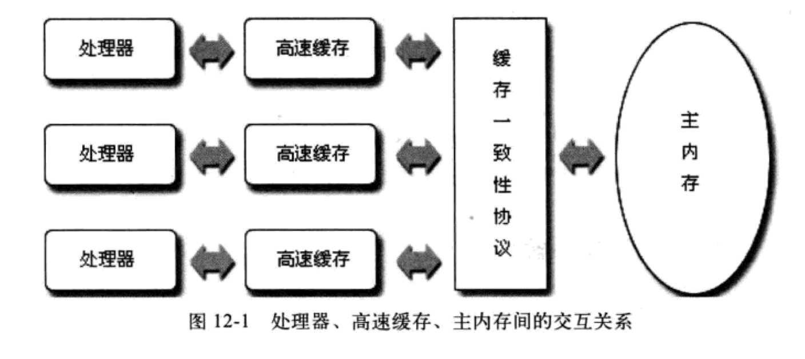
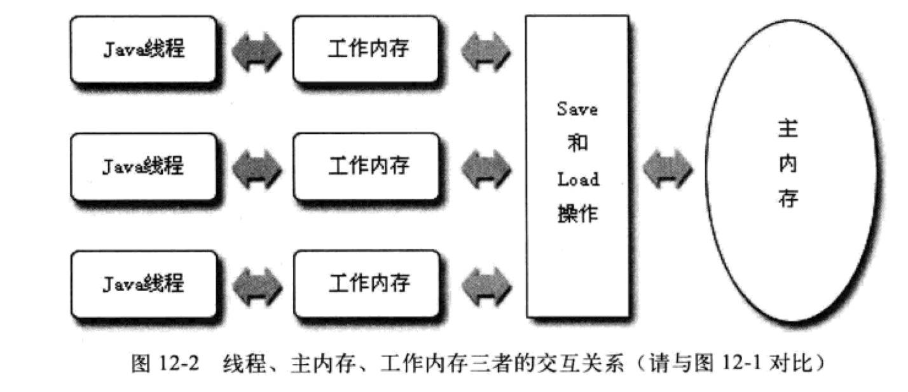
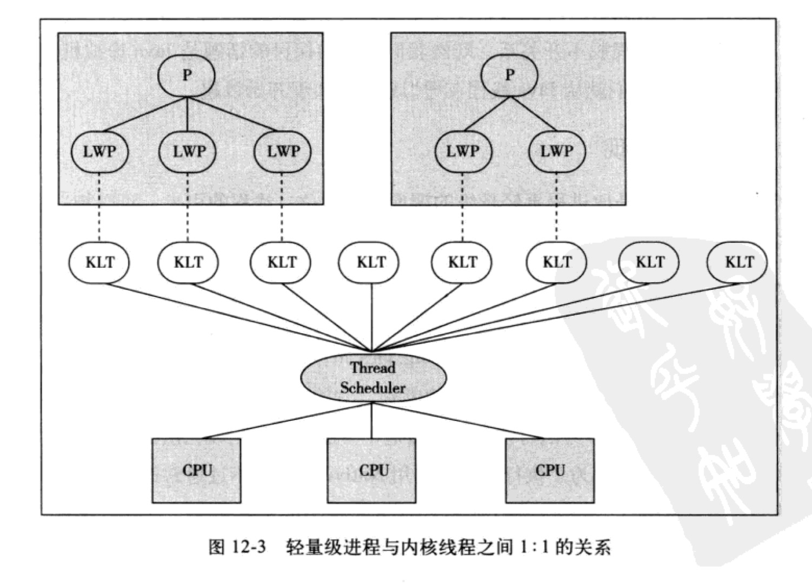
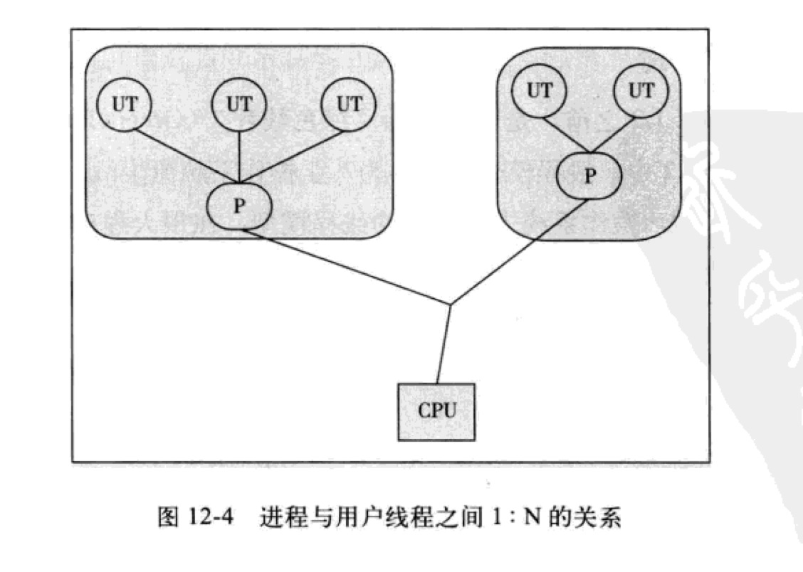
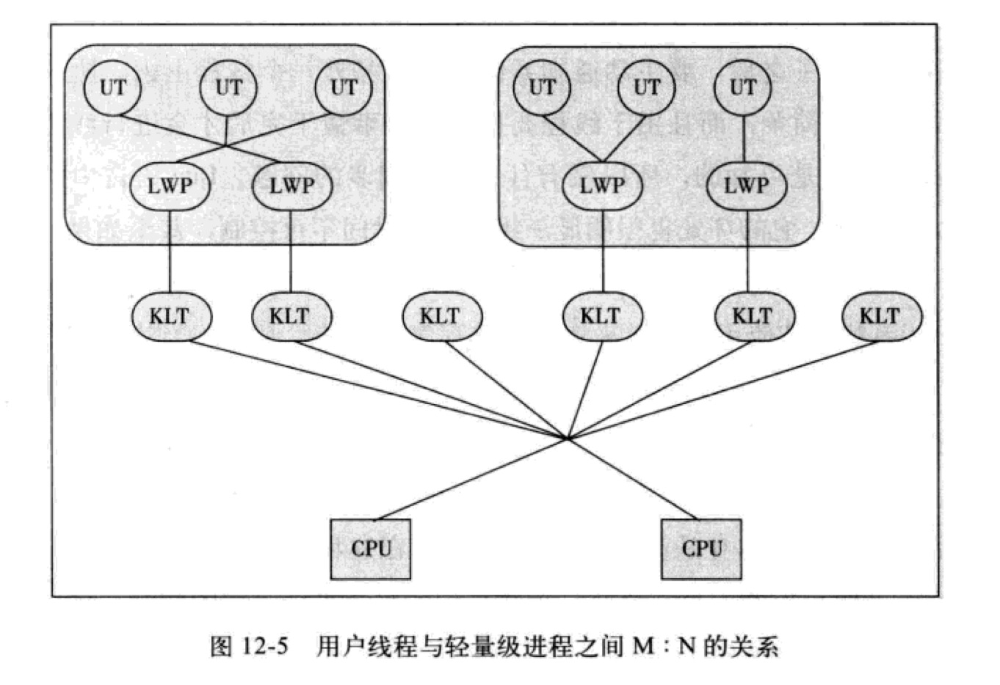
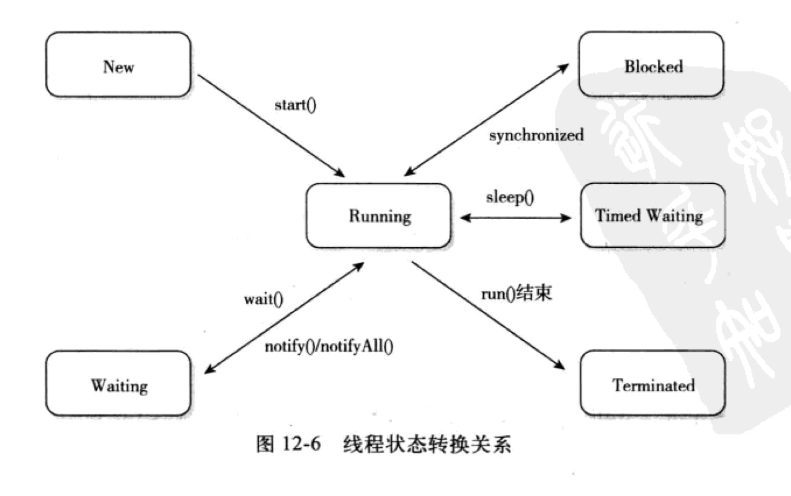

###前言

我们知道，多任务处理已经成了现代计算机的标配。在很多情况下，计算机可以“同时”做很多事情，但是因为CPU速度和其它设备之间的速度差别太大，比如磁盘IO、网络传输、数据库访问等等。如果不希望CPU在进行这些操作时一直处于等待的状态，就要充分压榨它的性能。

目前在服务器端，衡量一个服务性能的高低好坏，每秒事务处理数（Transactions Per Second,TPS)是最重要的指标之一，它代表一秒内服务器端平均能响应的请求总数，而TPS的值与程序的并发能力又有非常密切的关系。对于计算量相同的程序，线程并发设计的越好，效率自然越高；反之，线程间的频繁阻塞甚至死锁，将会大大降低程序的并发能力。

可见，并发是一个非常值得研究的问题。好在Java对并发进行了各种底层封装，使得程序员可以专注于业务逻辑而不必纠缠于这些复杂的细节。但是无论语言、中间件和框架如何优化，我们都不能100%保证它们能完美的解决并发问题，了解并发的内幕则是合格程序员的必经之路。

高效并发是《深入理解Java虚拟机》的最后一部分，将介绍虚拟机如何实现多线程、多线程之间由于共享和竞争数据而导致的一系列问题及解决方案。

这一章分为下面几个模块，重点在于后两个知识点：

* 硬件的效率和一致性
* Java内存模型
* Java与线程

###一、硬件的效率与一致性

如果学过操作系统，这一块就很容易理解了。我们知道，计算机的执行速度是一个正三角模型，从上到下依次为：

* CPU
* 高速缓存
* 内存
* 外存

所以，要实现**计算机并发执行多个任务和充分利用计算机CPU的性能**就不是那么简单了。因为CPU和内存、外存的速度差别太大（跨越N个数量级），所以提出了高速缓存的概念。高速缓存是读写速度尽可能接近CPU运算速度的存储区域，它作为内存与CPU之间的缓冲：将运算需要使用到的数据复制到缓存中，让CPU进行运算，当运算计算后再从缓存同步到内存中，这样就无须等待缓慢的内存读写了。

引入高速缓存很好的解决了CPU与其它存储单元速度差异太大的问题，但同时也引入了新的问题——缓存一致性。在多CPU机器上，每个CPU都有自己的高速缓存，而它们又共享一个主内存，当多个CPU的运算任务都涉及内存的同一块区域时，就可能导致缓存不一致的情况，如果真是这样，那同步回内存的缓存以谁的数据为主呢？为了解决这个问题，需要各个CPU访问缓存时遵守一定的协议，比如MSI、MESI、MOSI等等。

整个过程可以用下图说明：



###二、Java内存模型

首先最重要的一点是要知道为什么要有Java内存模型。

> Java虚拟机规范定义了Java内存模型（Java Memory Model，JMM)来实现**屏蔽掉各种硬件和操作系统的内存访问差异，以实现让Java程序在各种平台下都能达到一致的并发效果。**

在此之前，C/C++直接使用物理硬件（或者说是操作系统的内存模型），因此会导致不同平台、不同操作系统的差异：在一个平台上并发完全正常，到了另一个平台可能程序就会经常出错。因此还得针对不同的平台开发不同的C/C++版本。而Java为了实现平台无关性（Write Once，Run Anywhere），就定义了JMM。但是定义一个MM绝非易事：

* 必须足够严谨：这样才能保证Java的兵法操作不会产生歧义
* 必须足够宽松：使JVM的实现可以有足够的自由空间去利用硬件的各种特性（寄存器、高速缓存等）来获取更好的执行速度

####1. 主内存与工作内存

Java内存模型的主要目标是**定义程序中各个变量的访问规则，即在虚拟机中奖变量存储到内存和从内存中取出变量这样的底层细节。**此处的变量不Java程序中的变量略有区别，它包括了实例字段、静态字段和构成数组对象的元素，但是不包括局部变量和方法参数，因为它们是线程私有的，不会被共享，自然不存在竞争问题。

Java内存模型规定了所有的变量存储在JVM的主内存中。每条线程还有自己的工作内存（类比高速缓存）。线程工作内存中保存了被该线程使用到的变量的主内存副本拷贝，线程对变量的所有操作（读取、赋值等）都必须在工作内存中进行，而不能直接读写主内存中的变量。不同线程之间的工作内存也是相互独立的，线程间变量值传递均需要主内存完成。线程、主内存、工作内存之间的关系如下图所示：



####2. 内存间交互操作

关于主内存和工作内存之间的消息，主要是主->工作和工作->主，JMM定义了8种操作：

* lock：作用于主内存的变量，把一个变量标识为一条线程独占的状态
* unlock：作用于主内存的变量，把一个lock的变量解锁，可供其他线程使用
* read：作用于主内存的变量，把一个变量值从主内存传输到线程的工作内存，供load动作使用
* load：作用于工作内存的变量，把read操作从主内存得到的变量值放入工作内存的变量副本中
* use：作用于工作内存的变量，把工作内存一个变量的值传递给执行引擎，当JVM遇到使用该变量的字节码指令会执行use操作
* assign：作用于工作内存的变量，把一个从执行引擎接收到的值赋值给工作内存的变量，每当虚拟机遇到一个给变量赋值的字节码指令时执行assign操作
* store：作用于工作内存的变量，把工作内存中一个变量的值传递给主内存中，供write动作使用
* write：作用于主内存的变量，把store操作从工作内存中得到的变量的值放入主内存的变量中

从上面的规则，我们可以简单说几个例子说明一下。比如要把一个变量从主内存复制到工作内存，就要按顺序执行read和load操作；如果把一个变量从工作内存同步到主内存，就要按顺序执行store和write操作。

与此同时，JMM还规定了在执行上述8种基本操作时必须满足如下规则：

* 不允许read和load、store和write操作之一单独出现，必须成对出现。即不允许一个变量从主内存读取了但工作内存不接受，或者从工作内存发起同步，主内存不接受
* 不逊于一个线程丢弃assign操作，即变量在工作内存中改变了以后必须同步回主内存
* 不允许一个线程无原因（没有任何assign操作）就把数据从工作内存同步回主内存（因为是无用功嘛）
* 一个新的变量只能在主内存中“诞生”，不允许在工作内存中直接使用一个未被初始化（load或assign）的变量，即对一个变量实现use和store操作之前，必须执行过assign或者load操作
* 一个变量在同一个时刻只允许一条线程对其lock，但lock可以被同一条线程重复执行多次，多次lock后也得有相同次数的unlock才能解锁
* 对一个变量执行lock操作，将会清空工作内存中这个变量的值，在执行引擎使用这个变量前，需要重新执行load或assign初始化变量的值
* unlock时必须保证是同一个线程在先前对这个变量执行过lock
* 对一个变量执行unlock之前，必须把此变量同步回主内存

####3. volatile型变量

关键字volatile是Java虚拟机提供的最轻量级的同步机制，但是它并不容易被正确地、完整地理解，所以在遇到多线程数据竞争的问题时一律使用synchronized来进行同步。而了解volatile变量的语义对后面了解多线程操作的其他特性有很重要的意义，所以我们先通俗的说一下volatile的语义。

对一个变量被定义为volatile之后，将具备两种特性

**保证此变量对所有线程的可见性**

这里的可见性指当一个线程修改了这个变量的值，新值对于其他线程来说是可以立即得知的。而普通变量则需要通过主内存作为桥梁：线程A修改了一个普通变量的值，需要先向主内存进行回写，线程B在线程A完成回写后才能从主内存读取到新值，而之前还是线程A修改前的值。

但是关于volatile变量的可见性，如果没有深入了解，是会被误解的，常见的一种错误描述是“volatile变量对所有线程是立即可见的，对volatile变量的所有写操作都能立刻反应到其它线程中。换句话说，volatile变量在各个线程中是一致的，所有基于volatile变量的运算在并发下是安全的”。这句话其实是错误的，不能得出“基于volatile变量的运算在并发下是安全的”这个结论。

> volatile变量在各个线程的工作内存中是不存在一致性问题（是因为执行引擎在使用这个变量时，都会显式刷新后使用），但是Java运算并非原子操作，如下例子：


public class VolatileTest {
	public static volatile int race = 0;
	
	public static void increase() {
		race++;
	}
	
	private static final int THREADS_COUNT = 20;
	
	public static void main(String[] args) {
		Thread[] threads = new Thread[THREADS_COUNT];
		for(int i = 0; i < THREADS_COUNT; i++) {
			threads[i] = new Thread(new Runnable() {
				
				@Override
				public void run() {
					for(int i = 0; i < 10000; i++) {
						increase();
					}
				}
			});
			threads[i].start();
		}
		
		while(Thread.activeCount() > 1) {
			Thread.yield();
		}
		
		System.out.println(race);
	}
}


这段代码发起了20个线程，每个线程对race累加10000次+1操作，如果代码正确运行则结果为200000，但是最后结果却小于200000，而且每次运行结果还不同。问题就出在race++这一行代码上，用javap反编译后看到race++实际上是由4条语句构成的(不算return)：



0:	getstatic #13;
3:	iconst_1
4:	iadd
5:	putstatic	#13;
8:	return


失败原因这时候就明了了，当getstatic把race值取到栈顶时，volatile保证了race的值在这时是正确的，但是在执行iconst_1/iadd这些指令的时候，其他线程可能修改了race的值（增大了），那么操作数栈栈顶的值就成了过期数据，所以putstatic指令执行后就会把较小的race值同步回写到主内存中，最后造成结果小于200000.

结论就是：

> 由于volatile变量只保证可见性，在不符合以下两条规则的运算场景中，我们仍然需要通过加锁（使用synchronized或者java.util.concurrent中的原子类）来保证原子性
>
>	* 运算结果并不依赖变量的当前值，或者能够确保只有单一的线程修改变量的值
>	* 变量不需要与其他的状态变量共同参与不变约束

从而可以得出正确使用volatile的场景，如下例子：


volatile boolean shutdownFlag;

public void shutdown() {
	shutdownFlag = true;
}

public void threadsWork() {
	while(!shutdownFlag) {
		//do something
	}
}


这样，保证只有一个线程去调用shutdown。就可以让所有线程看到shutdownFlag是否生效，如果生效，则全部线程都会停止。


**禁止指令重排序优化**

普通的变量仅仅保证在该方法执行过程中所有依赖赋值结果的地方都能获取正确的值，而不能保证变量赋值操作的顺序与程序代码的执行顺序一致。因为在一个线程的方法执行过程中无法感知到这点，这也就是JMM描述的所谓“线程内表现为串行的语义”。当然，我知道这句话你是看不懂的，所以show me the code:


Map configOptions;
char[] configText;
//此变量必须定义为volatile
volatile boolean initialized = false;

//假设以下代码在线程A中执行
//模拟读取配置信息，读取完成后将initialized置为true通知其他线程配置可用
configOptions = new HashMap();
configTest = readConfigFile(fileName);
processConfigOptions(configText, configOptions);
initialized = true;

//假设以下代码在线程B中执行
//等待initialized为true，代表线程A已经把配置初始化完成
while(!initialized) {
	sleep();
}

//读取配置，开始干活
doSomethingWithConfig();


上面代码描述的场景应用的很常见，如果定义的initialized没有volatile修饰，就有可能因为指令重排序的优化，导致位于线程A最后一句的代码`initialized = true;`提前执行，这样线程B执行肯定出错。所以volatile关键字可以避免此类情况的发生。

上面这一大坨东西都在说明volatile是神马东西。那么，它在性能上表现如何呢？是否比其他的同步工具更快呢？

> 确实在某些情况下，volatile同步机制的性能要优于锁（使用synchronized或者java.util.concurrent包的锁），但因为JVM的各种优化，这方面是无法一刀切的。所以，使用volatile的原则是**满足使用场景的需求即可**

####4. 对于long和double型变量的特殊规则

在第六章class文件中我们知道，long和double都占据了2个连续的slot，但是因为局部变量表是线程私有，所以不会出现数据安全的问题。而且JMM虽然允许JVM不把long和double变量的读写实现为原子操作，但是还是“强烈建议”JVM这么干，毕竟出了事还是JMM背黑锅嘛。所以在实际应用中，各平台的商用JVM几乎都选择把64位数据的读写操作作为原子操作。所以在编写代码时就不用担心读取long或者double类型半个slot的问题了。

####5. 原子性、可见性、有序性

前面介绍JMM的相关操作和规则，现在从整体上回顾一下。

* 原子性：JMM会保证read/load/assign/use/store/write的原子性，如果需要更大范围的原子性，可以使用lock和unlock，这个从代码层面来看就是synchronized
* 可见性：可见性就是当一个线程修改了共享变量的值，其他线程能立即得知这个修改。而volatile就是搞这个的。JMM通过变量修改后回写主内存，读取前从主内存刷新变量值这种依赖主内存作为中介的方法实现可见性，只不过volatile的特殊规则能使新值立即同步主内存，使用前立即从主内存刷新。所以可以说volatile保证了多线程操作时变量的可见性，而普通变量不能保证这一点。除了volatile之外，Java还有两个关键字能实现可见性：synchronized和final，synchronized是由“对一个变量执行unlock操作之前，必须把此变量的值回写到主内存”这条规则实现的，细想一下，就明白了。而final是由“被final修饰的字段在构造器中一旦被初始化完成，并且构造器没有把this引用传递出去，那么在其他线程中就能看见final字段的值”
* 有序性：JMM的有序性可以总结为一句话：本线程内观察，所有的操作都是有序的；如果是旁观者线程，被观察线程的操作都是无序的。前半句是指”线程内表现为串行的语义“，后半句是指”指令重排序“和”工作内存和主内存存在同步延迟“的现象。Java语言提供了volatile和synchronized保证线程之间操作的有序性。

介绍这三种特性后可能会发现，synchronized在这三种特性中都能出色的完成任务。的确，大部分的并发控制操作都能使用synchronized来完成。但是也因为它的万能，使得它的使用被程序员滥用的局面逐渐增多，越通用的东西，需要考虑的东西太多，性能肯定会受到影响。这点在下一章好好谈谈。

####6. 先行发生原则

这个可以用拓扑排序的例子来说明，举个例子吧：

```
//线程A
i = 1;

//线程B
j = i;

//线程C
i = 2;
```

如果保证A先行发生于B，那么B的值是多少？很悲桑，不确定。因为还有C这个魂淡。所以线程B就不具备多线程安全性。为了解决这种问题，JMM定义了一些”天然的“先行发生关系来保证多线程的安全，有兴趣的可以深入了解一下。

###三、Java与线程

其实并发不一定必须依靠多线程（PHP还依靠多进程并发呢），但是在Java中，并发和线程脱不开关系。所以，我们先来八一八线程的实现。注意，不是Java线程的实现，而是线程的实现哦。

我们知道，线程是比进程更轻量级的调度执行单位，线程的引入，可以把一个进程的资源分配和执行调度分开，各个线程既可以共享进程资源（内存地址、文件I/O等），又可以独立调度（线程是CPU调度的最基本单位）。

操作系统都提供了线程实现，Java语言实现的java.lang.Thread类的实例就代表一个线程。不过Thread类和大部分Java API不同的是，它的关键方法都被声明为Native：意味着这个方法没有使用或无法使用平台无关的手段来实现（当然也可能是为了执行效率，不过通常最高效率的手段肯定是平台相关的手段啦）。

实现线程主要有三种方式：

1. 使用内核线程实现
2. 使用用户线程实现
3. 使用用户线程+轻量级进程混合实现

####1. 使用内核线程实现

内核线程（Kernel Thread，KLT）是操作系统内核（Kernel）支持的线程，这种线程是由内核完成线程切换的：内核通过调度器（Scheduler）对线程进行调度，并负责将线程的任务映射到各个处理器上。每个内核线程都可以看做内核的一个分身。

程序一般不适用内核线程，而是使用内核线程的一种高级接口——轻量级进程（Light Weight Process, LWP)，轻量级进程就是我们通常意义所说的线程。每个轻量级进程都由一个内核线程支持，因此只有先支持内核线程，才能有轻量级进程。这种轻量级进程和内核线程1：1的关系称为**一对一的线程模型**，如下图所示：



下面说一下它的特点：

* 由于轻量级进程和内核线程是一对一的，所以每个轻量级进程都是一个独立的调度单元，即使阻塞了，也不会影响整个进程的工作
* 因为它基于内核线程实现，所以各种进程操作如创建、析构、同步，都需要系统调用。而系统调用代价相对较高，需要频繁在用户态和内核态切换。而且因为每个轻量级进程都需要一个内核线程的支持，所以会消耗一定的内核资源（如内核线程的栈空间）。**因此一个系统支持轻量级进程的数量是有限的**

####2. 使用用户线程使用

广义上说，不是内核线程，就可以被认为是用户线程。从这个定义看，轻量级进程也输入用户进程。而狭义的用户线程是指**完全建立在用户空间商的线程库上，系统内核是无法感知到线程的存在的。用户线程的创立、同步、销毁、调度完全在用户态完成，不需要内核的帮助。如果实现的牛逼，这种线程不需要切换到内核态，操作效率非常高，消耗也很低，而且支持大规模的线程数量（比如mysql？），部分高性能数据库中的多线程就是由用户线程实现的。**这种进程与用户线程之间1：N的关系被称为**一对多的线程模型**，如下图所示：



优缺点：

* 实现好的话，效率奇高
* 但是也正因为没有内核的帮助，所以操作都需要用户程序自己处理。实现起来非常复杂，Java原来使用的也是用户线程，后来因为实现起来太复杂就放弃了

####3. 使用用户线程+轻量级进程混合实现

用户线程完全建立在用户空间中，因此用户线程的创建、切换、析构依然廉价，支持大规模的用户线程并发。而轻量级进程则作为用户线程和内核线程的桥梁，这样可以使用内核提供的线程调度功能及处理器映射，并且用户线程的系统调用通过轻量级进程完全，降低了进程被阻塞的风险。这种混合模式下，用户线程和轻量级进程的数量比不确定，一般称为**多对多线程模型**，如下图所示：



许多Unix系列的操作系统如Solarix都实现了多对多线程模型。

####4. Java线程的实现

这里说一下Java线程是如何实现的。

* JDK 1.2之前，用户线程实现
* JDK 1.2，由于用户线程模型太过复杂，替换为操作系统原生线程模型实现。对Sun JDK而言，它的Win和Linux都是使用一对一的线程模型实现的；而在Solaris平台，可以选择使用一对一线程模型或者多对多线程模型

####5. Java线程调度

分为两种：

* 协同式线程调度：一个线程把自己活**全部搞定**的情况下再通知下一个线程干活。好处是简单，坏处是一个线程有问题，整个程序就会阻塞，甚至崩溃
* 抢占式线程调度（Java线程调度方式）：根据优先级抢占，不过不同平台优先级定义不同

如果操作系统没忘的话，学习起来很轻松。

####6. 状态切换

Java语言定义了5种**进程状态**，在任意一个时间点，一个进程只可能处于一种状态。如果操作系统没忘，这块应该很清楚的。

* 新建：创建后尚未启动的进程
* 运行：处于运行状态的进程可能正在执行，也可能在等待CPU分配执行时间
* 无限期等待：处于这种状态的进程不会被分配CPU执行时间，需要被显式唤醒
* 限期等待：处于这种状态的进程不会被分配CPU执行时间，但是他们不需要被显式唤醒，自己会唤醒自己
* 阻塞：一般是临界区
* 结束：正常执行完毕

用一个图片可以说明他们之间是如何切换状态的：


