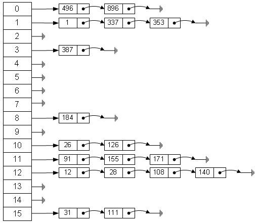

在 Java 集合类中，使用最多的容器类恐怕就是 HashMap 和 ArrayList 了，所以打算看一下它们的源码，理解一下设计思想。下面我们从 HashMap 开始说起。首先我们看下源码的版本：


java version "1.7.0_45"
Java(TM) SE Runtime Environment (build 1.7.0_45-b18)
Java HotSpot(TM) 64-Bit Server VM (build 24.45-b08, mixed mode)


接下来直接开始上代码了。

###一、HashMap 的实现原理

我们先从整体上把握一下 HashMap 的设计，其实也很简单，就是哈希表的使用，我们直接上图说明会更好。

这个图就是 HashMap 的核心，如果把这张图看懂了，其实 HashMap 已经理解了一大半。如果学过数据结构，这玩意就没啥说的了。简单总结一下：

> HashMap 使用哈希表作为底层数据结构，而哈希表的实现是结合**数组和链表**。我们知道数组的优点是分配连续内存，寻址迅速；而链表对于插入删除特别高效，所以综合使用数组和链表，就能进行互补。我们在插入删除的时候，首先根据 key 的 hash 值进行数组定位，每个数组都挂着一个链表，代表相同的 key 的元素，如果 hash 函数设计得当，基本不会出现链表过长的问题，这样就可以做到 O(1)插入、查询，所以极其高效。

###二、文档

第二步就是去看下文档，看看能不能捞到有效的信息。这里我直接 copy 一下官方文档吧。

> **Hash table based implementation of the Map interface（说明实现原理）**. This implementation provides all of the optional map operations, and permits null values and the null key. (**The HashMap class is roughly equivalent to Hashtable, except that it is unsynchronized and permits nulls.)（一句话说明 HashMap 和 HashTable 的区别）** This class makes no guarantees as to the order of the map（这个在讲到 transfer 的 时候就知道原因了）; in particular, it does not guarantee that the order will remain constant over time.
>
> This implementation provides constant-time performance for the basic operations (get and put)（get 和 set 都是常熟复杂度，是哈希表以空间换时间的代价）, assuming the hash function disperses the elements properly among the buckets. Iteration over collection views requires time proportional to the "capacity" of the HashMap instance (the number of buckets) plus its size (the number of key-value mappings). Thus, it's very important not to set the initial capacity too high (or the load factor too low) if iteration performance is important（遍历操作跟数组长度和链表长度有关，所以在遍历操作要求性能高的情况下，就不要将初始容量设置的过高或者装载因子设置的太低。为什么？看下面这段）.
> 
> **An instance of HashMap has two parameters that affect its performance: initial capacity and load factor. The capacity is the number of buckets in the hash table, and the initial capacity is simply the capacity at the time the hash table is created. The load factor is a measure of how full the hash table is allowed to get before its capacity is automatically increased. When the number of entries in the hash table exceeds the product of the load factor and the current capacity, the hash table is rehashed (that is, internal data structures are rebuilt) so that the hash table has approximately twice the number of buckets**（超过装载因子和容量的乘积就要进行 rehash 了，rehash 后容量近似是原来的2倍）.
>
> As a general rule, the default load factor (.75) offers a good tradeoff between time and space costs. Higher values decrease the space overhead but increase the lookup cost (reflected in most of the operations of the HashMap class, including get and put). The expected number of entries in the map and its load factor should be taken into account when setting its initial capacity(放入 map 的元素个数和装载因子在初始化的时候要考虑一下，因为 rehash 涉及到 copy 转移，会影响性能), so as to minimize the number of rehash operations. If the initial capacity is greater than the maximum number of entries divided by the load factor, no rehash operations will ever occur.
>
> If many mappings are to be stored in a HashMap instance, creating it with a sufficiently large capacity will allow the mappings to be stored more efficiently than letting it perform automatic rehashing as needed to grow the table. Note that using many keys with the same hashCode() is a sure way to slow down performance of any hash table. To ameliorate impact, when keys are Comparable, this class may use comparison order among keys to help break ties.
>
> **Note that this implementation is not synchronized**(HashMap 不是线程安全的，这点极其重要。我打算再写篇文章分析一下). If multiple threads access a hash map concurrently, and at least one of the threads modifies the map structurally, it must be synchronized externally. (A structural modification is any operation that adds or deletes one or more mappings; merely changing the value associated with a key that an instance already contains is not a structural modification.) （这里说明了什么情况需要加锁）This is typically accomplished by synchronizing on some object that naturally encapsulates the map. If no such object exists, the map should be "wrapped" using the Collections.synchronizedMap method. This is best done at creation time, to prevent accidental unsynchronized access to the map:
> 
>   `Map m = Collections.synchronizedMap(new HashMap(...));`
>
> The iterators returned by all of this class's "collection view methods" are fail-fast: if the map is structurally modified at any time after the iterator is created, in any way except through the iterator's own remove method, the iterator will throw a ConcurrentModificationException. Thus, in the face of concurrent modification, the iterator fails quickly and cleanly, rather than risking arbitrary, non-deterministic behavior at an undetermined time in the future.(讲的是 fail-fast 机制，当迭代过程中哈希表被增或者删，不包括改，就会抛出异常，而不会推迟到程序出问题)
>
> Note that the fail-fast behavior of an iterator cannot be guaranteed as it is, generally speaking, impossible to make any hard guarantees in the presence of unsynchronized concurrent modification. Fail-fast iterators throw ConcurrentModificationException on a best-effort basis. Therefore, it would be wrong to write a program that depended on this exception for its correctness: **the fail-fast behavior of iterators should be used only to detect bugs**.（程序不应该依赖 fail-fast 机制，使用 fail-fast 的唯一用处就是检测 bug）
>
> This class is a member of the Java Collections Framework.

上面就是 HashMap 的文档，重要的地方我用黑体字注明并进行了简短的说明。卧槽，上面弄完就累了- -下面要 show code 了。。。

###三、源码剖析

首先我们看这个类
